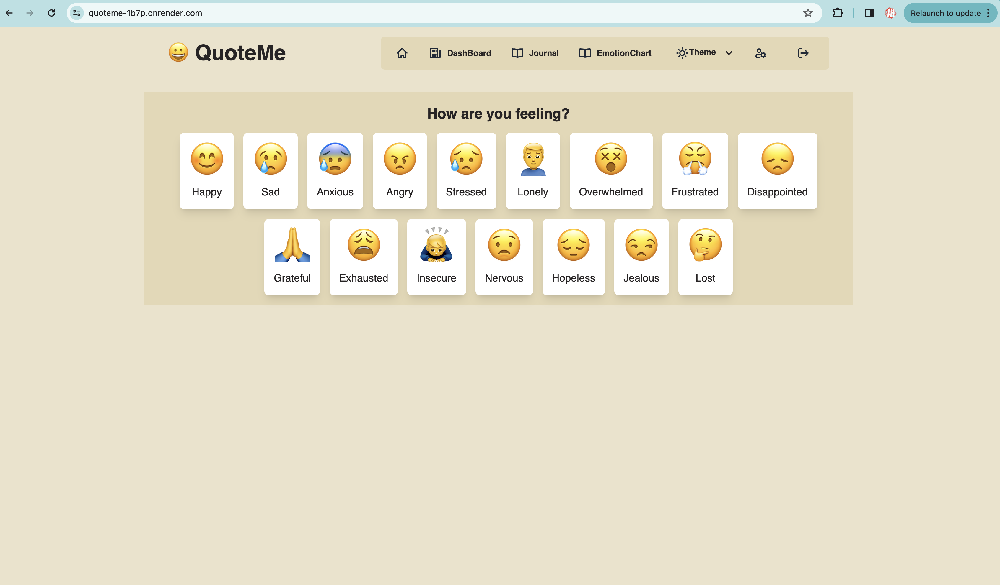
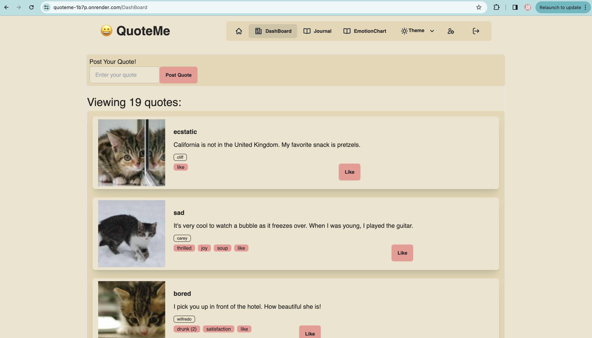

# QuoteMe

## Description

QuoteMe is a web application designed to enhance emotional well-being through personalized affirmations, shared mindfulness experiences, and private journaling. Our motivation was to create a platform that fosters a supportive community for individuals to reflect on their feelings, find motivation, and connect with others on a similar journey.

- **What problem does it solve?** QuoteMe offers a space for self-reflection and personal growth by providing users with affirmations based on their current emotions and a bulletin board to share and read inspirational stories.
- **What did we learn?** This project was an exploration into building full-stack applications using MERN stack, emphasizing React for frontend development and GraphQL for efficient data handling.

## Table of Contents

- [Installation](#installation)
- [Usage](#usage)
- [Features](#features)
- [Contribution](#how-to-contribute)
- [Tests](#tests)
- [Credits](#credits)
- [Dependencies](#dependencies)
- [License](#license)

## Installation

To install QuoteMe on your local computer:

1. Clone the repository to your local machine.\
   `git clone https://github.com/charleshuurman/QuoteMe`
2. Run `npm install` to install package dependencies for both the client and server parts.
3. run `npm run seed` to populate the database with seed data (optional).
4. Start the application by running `npm run develop` from the root directory, which concurrently launches both the client and the server.

## Usage

Since it's deployed in Render, please follow the link: [QuoteMe App in Render](https://quoteme-1b7p.onrender.com/)

You can also install the application locally by following the installation instructions above.

After installation, the app will be accessible on your local server. Navigate through the app to:

- Sign up and manage your profile.
- Generate affirmations based on your current emotions.
- Share and read stories on the mindfulness bulletin board.
- Write and maintain a private journal.
- Change the Theme to your liking from more than 10 color schemes.
- See your Emotion Chart to see statistics of your feelings. 
- Change your subscription plan to access the mindfulness bulletin board.
- See your profile statistics.

Screenshots of the application in use:

## Features

- Secure user authentication system.
- Emotion-based affirmation generator.
- Community bulletin board to share and like stories.
- Private journal for personal reflections.
- Write and maintain a private journal.
- Change the Theme to your liking from more than 10 color schemes.
- See your Emotion Chart to see statistics of your feelings. 
- Change your subscription plan to access the mindfulness bulletin board.
- See your profile statistics.
- Responsive design for a seamless experience on various devices.

## How to Contribute

Contributions to QuoteMe are always welcome! To contribute:

1. Fork the repository.
2. Create a new branch for your feature (git checkout -b feature/AmazingFeature).
3. Commit your changes (git commit -m 'Add some AmazingFeature').
4. Push to the branch (git push origin feature/AmazingFeature).
5. Open a pull request.

Please adhere to the Contributor Covenant [Contributor Covenant](https://www.contributor-covenant.org/). code of conduct in your interactions with the project.

## Credits

Developed by a dedicated team, special thanks to:

- [KyoSook Shin](https://github.com/alla0810)
- [Andre Nurwono](https://github.com/andrenrwn)
- [Emily Knight](https://github.com/emilygknight)
- [Devon Rooks](https://github.com/diffwentstrokes)
- [Megan Wright](https://github.com/mmw18)
- [Charles Huurman](https://github.com/charleshuurman)
- Materials provided by the University of Texas for Project 26 in the MERN Stack curriculum.

## Dependencies

This project uses the following direct dependencies:

- `express`: Fast, unopinionated, minimalist web framework for node.
- `mongoose`: MongoDB object modeling designed to work in an asynchronous environment.
- `react`: A JavaScript library for building user interfaces.
- `graphql` : An API query middleware that allows flexibility and efficiency to building APIs
- `@apollo/client/server`: A comprehensive state management library for JavaScript that enables you to manage both local and remote data with GraphQL.
- `daisyUI + tailwindCSS`: A UI CSS framework that works with React for rapid styling
- `bcrypt`: a library for hashing passwords
- `jsonwebtoken`: tokens which store and encrypt authentication information and is stored on the browser, similar to cookies but isn't as restricted
- `stripe`: a payment library to accept payment from credit cards and other methods

## License
This project is released under the MIT License. See the [LICENSE](LICENSE.md) file for details
